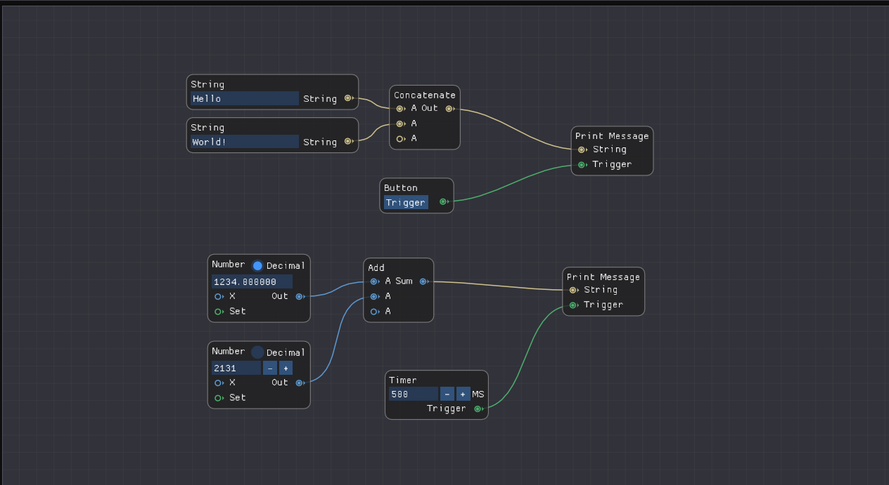
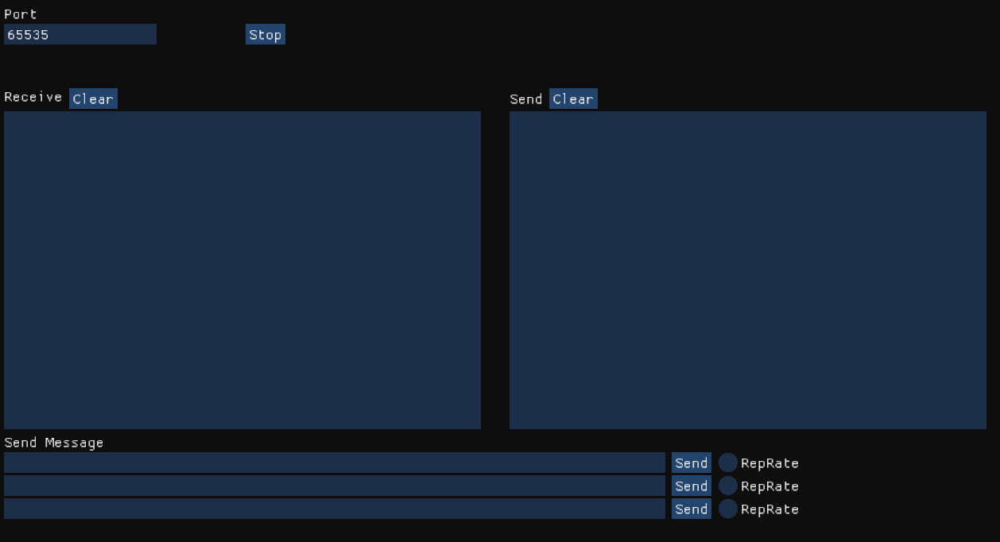

# TCPCafe
ImGUI based tool for testing TCP connections

## Demo

Node Editor View

TCP Server View

## Building

### Generators
Tested Compilers: MSVC, MinGW

### CMake
1. Create Directory /build
1. cd build
1. cmake -G "Generator Name" ..
1. cmake --build .
1. ./TCPCafe.exe
